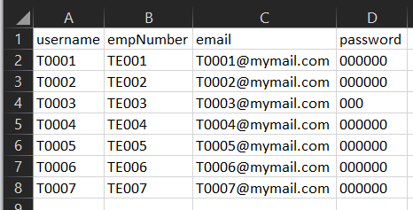
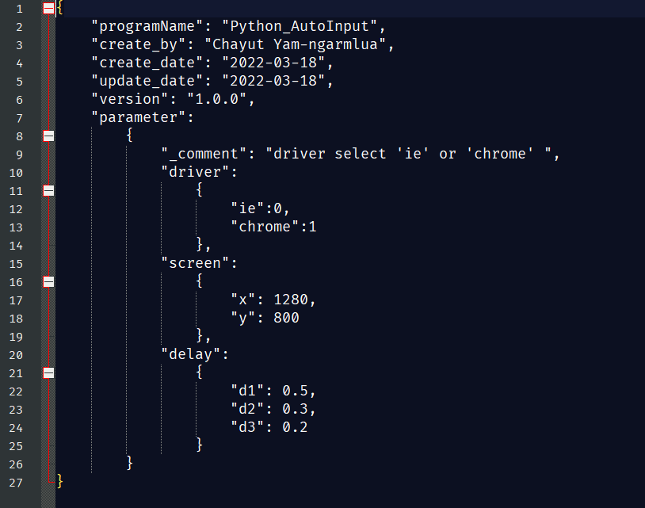

# Hello! Welcome to my first python project. 
This project use for class UltimatePython. The target of this project is to create an automatic input bot by reading the data in csv file (by pandas) and input to the input form in target website (by selenium). And prevent some error because of data in csv file such as input duplicate data or wrong input condition (ex. username too short ...) and show the result after finish the process (use pyautogui -> alert).

### Because of privacy of network condition so the link of input form in website in the code is in local server so you can't access to that network.

<!--  -->

---
## Library
1. selenium
2. pandas
3. pyautogui
4. os, sys, json

---
## How it work ?
1. First at the login page there are like to go to register page. Click it!

  &nbsp;&nbsp;&nbsp;&nbsp;&nbsp;&nbsp;&nbsp;&nbsp;&nbsp;&nbsp;&nbsp;&nbsp;

2. In register page there are some textbox to fill.

  &nbsp;&nbsp;&nbsp;&nbsp;&nbsp;&nbsp;&nbsp;&nbsp;&nbsp;&nbsp;&nbsp;&nbsp;

3. Use `pandas` to read the csv file in folder "Data/inputData.csv" as dataframe. And use `selenium` to find element and fill the data.
  
  &nbsp;&nbsp;&nbsp;&nbsp;&nbsp;&nbsp;&nbsp;&nbsp;&nbsp;&nbsp;&nbsp;&nbsp;  

4. If register complete the pop-up message will be show and return back to login page.

  &nbsp;&nbsp;&nbsp;&nbsp;&nbsp;&nbsp;&nbsp;&nbsp;&nbsp;&nbsp;&nbsp;&nbsp; 

5. Loop until end of csv file. Finish!

... From the example there are 2 error show when finish precess because...
1. Password of user 'T0003' is too shot ( only 3 digits but program require 6 digits )  
2. User 'T0006' already exists in database.

  &nbsp;&nbsp;&nbsp;&nbsp;&nbsp;&nbsp;&nbsp;&nbsp;&nbsp;&nbsp;&nbsp;&nbsp; 

---
## Config setting.json

For the convenience of some user I design to create a setting.json file for user manualy edit some parameter such as ...
- screen heigh or width of the driver window.
- the delay of each step (**Please not set too fast or the program will error because driver can not find the element while page is loading**
  &nbsp;&nbsp;&nbsp;&nbsp;&nbsp;&nbsp;&nbsp;&nbsp;&nbsp;&nbsp;&nbsp;&nbsp;

